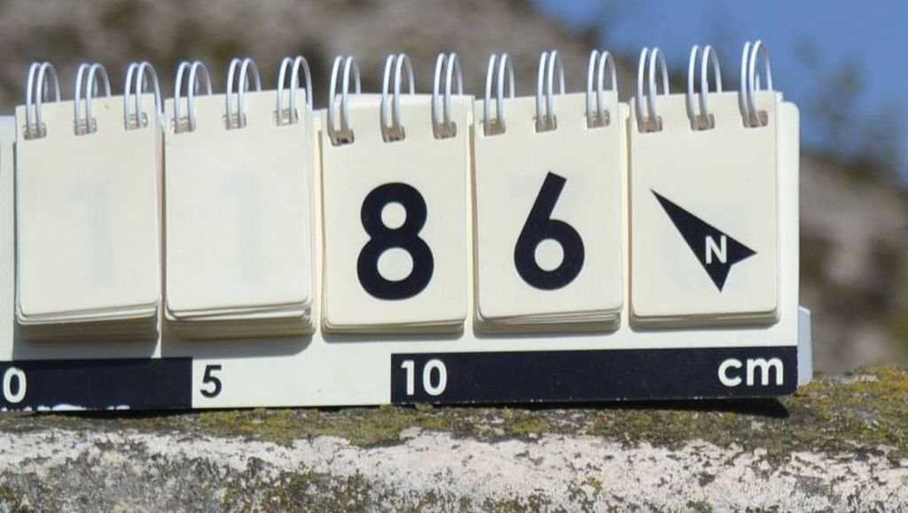
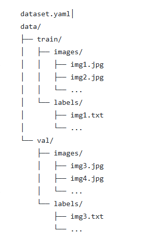
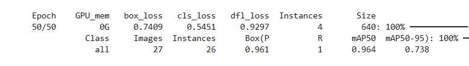
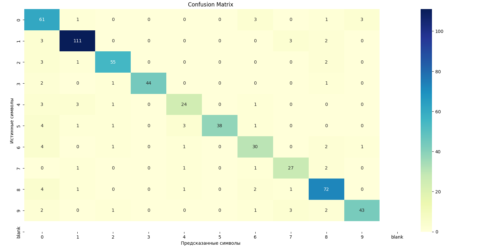
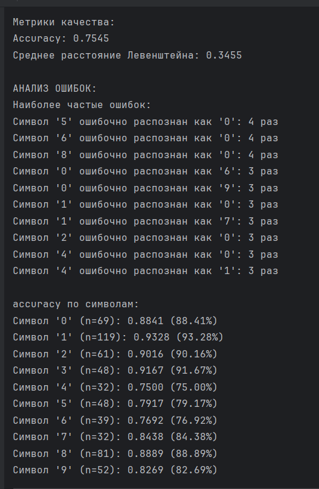

# Детекция и распознавание номеров объектов на фотографиях

**Описание проекта:** Группа исследователей в экспедициях фотографирует объекты. На фотографиях рядом с объектами устанавливается перекидное табло, на котором выставляется номер объекта. Для экономии времени идентификации и переименования фотографий в соотвествии с изображёнными на них объектами возникла потребность в создании приложения для автоматизации этой функции.

Общие требования к приложению
1.	Работа локально на ПК без необходимости подключения к сети
2.	Возможность групповой обработки фото из выбранной папки на локальном диске
3.	Работа с изображениями в формате jpeg.

Описание работы приложения
1.	После запуска приложение запрашивает путь к папке с фото, которые нужно переименовать.
2.	Приложение по порядку анализирует файлы с фото в указанной локальной папке и распознаёт номера на табличках (см. примеры). Номер может иметь от 1 до 4 разрядов и содержать одну латинскую букву (a, b, c, d или e) в конце.
3.	В случае успешного распознавания, исходное имя файла заменяется (или дополняется) номером. При этом, если номер меньше 1000, то он дополняется нулями до 4-х разрядов.
4.	Если несколько фото имеют один и тот же номер (памятник сфотографирован несколько раз), то у каждого последующего файла при переименовании к номеру добавляется окончание _1, _2, _3…
5.	Если номер распознан с невысокой вероятностью, переименование выполняется, но в конце имени перед именем добавляется пометка !_.
6.	Если номер на фото не обнаружен (или распознать его не удалось), то переименование не выполняется и сохраняется исходное имя файла. Перед именем добавляется пометка !_.
7.	После завершения переименования программа выводит отчет, в котором указано:
a.	Кол-во переименованных файлов.
b.	Кол-во и полный список файлов с низкой надёжностью распознавания.
c.	Кол-во и полный список непереименованных файлов (с исходными именами).

 

**Цель проекта:** создать приложение для автоматического переименования фотографий в соответствии с изображенным на них номером объетка без подключения к сети.
 

**Структура проекта:**
- процесс обработки данных
- анализ примеров изображений
- разметка данных
- обучение модели для детектирования табло с номерами на фотографиях
- подготовка данных для обучения модели распознавания номеров объектов на табло
- выбор модели распознавания
- обучение модели распознавания
- анализ обученной модели
- добавление логики переименования файлов и создания файла с логами

## Процесс обработки данных
Процесс обработки папки с изображениями [main.py](src/main.py):
 - запрос на ввод пути к папке с изображениями
 - запрос ввода префикса
 - запуск функции обработки папки с изображениями
   - в цикле по изображениям из папки запускается функция обработки изображения. Внутри функции обработки изображения происходит:
     - детектирование табло (с уверенностью детекции)
     - вырезка табло из изображения
     - распознавание текста на вырезанном фрагменте (с уверенностью распознавания)
     - построение датафрейма с результатами детекции и распознавания по каждому изображению, вычисление новых имён файлов
     - переименование файлов
   - печать датафрейма с результатами в файл xlsx, создание csv файл с разметкой - имя_изображения,распознанный текст

## Анализ примеров изображений
Заказчик предоставил 1200 изображений.
На фотографиях объекты, на которых (или рядом) установлены перекидные табло вида (небольшой фрагмент изображения)

В наименовании фото присутсвует номер табло, заданный префикс и постфикс с порядковым номером изображения объекта, если есть больше одного для данного объекта. Есть ~10 фотографий, на которых табло отсутствует.

Табло на изображении может быть наклонено, содержать блики, тени и другие артефакты на изображениях, которые частично перекрывают цифры. Табло может находиться под прямым углом к вертикальной оси изображения.

Последний символ табло - указатель на север в виде стрелки, которая бывает нескольких видов.

В большинстве случаев табло достаточно контрастное относительно окружающего фона.

## Разметка данных

Разметка для модели детектирования осуществлялась в CVAT. Размечено 210 фотографий с применением bounding box. Рамка располагалась максимально близко к границам табло. Выделялось табло целиком с пустыми разрядами и указателем на север. 

## Обучение модели для детектирования табло с номерами на фотографиях
В качестве модели для детекции была выбрана модель YOLO ('yolov8n.pt').
Перед запуском обучения данные были подготовлены в следующей структуре:

В тренировочную выборку вошло 180 элементов, в валидационную 30.
Код обучения [det_model_train.py](src/det_model_train.py)

На 50 эпохах модель достигла Retail = 1 и Accuracy = 96%.

На тестовых образцах рамки соответствуют границам табло.

Доработка на будущее - разметить больше изображений и переобучить.

## Выбор модели распознавания
На примерах вырезанных изображений табло были опробованы следующие "коробочные" решения с настройкой параметров - EasyOCR, PaddleOCR, Tesseract-OCR. Результат оказался неудовлетворительным - даже на чётком изображении (как в примере выше) без дополнительных бликов и помех номер определялся некорректно.

Был опробован путь посимвольного распознавания через нахождение контуров. Из изображения вырезались контуры (с учётом размера контуров), сортировались по координате x и подавались на вход модели распознавания. Модель обучалась на синтезированных изображениях цифр (для шрифта табло) с аугментациями. От этого подхода пришлось отказаться, так как кроме цифр, в качестве контуров регистрировались особенно широкие тени между сегментами табло, пружина табло и прочие артефакты. Данные артефакты распознавались как цифры с достаточно большой уверенностью (более 95%) для случаев вертикальных теней - как "1" и для случаев пружины - как "3".

В качестве модели распознавания было решено обучить модель архитектуры CRNN + CTC. Данная связка хорошо подходит для случаев строк неравномерной длины. Изображение анализируется как последовательность столбцов, учитывается контекст и взаимосвязи между символами, работает на зашумлённых изображениях.

## Подготовка данных для обучения модели распознавания
Для обучения и теста модели распознавания были подготовлены вырезанные из фотографий изображения табло для всех предоставленных образцов.
Код обработки [roi_cutting_for_ocr.py](src/roi_cutting_for_ocr.py). В случае если детектированная рамка по высоте больше, чем по ширине, делаем поворот на 90.
Изображение может быть перевёрнутым, но это учтём аугментациями в тренировочной выборке.
Написан код [label_extraction.py](src/label_extraction.py) создания пар имя фото/изображённый на нём номер и сохранения его в csv [label_list.csv](label_list.csv) формате для дальнейшего использования в качестве разметки при обучении.

## Обучение модели распознавания
[ocr_model_train.py](src/ocr_model_train.py)

В тренировочную выборку определено 880 изображений, в тестовую - 320. Так как изображений очень мало для обучения - дополнительно сгенерированы 4 копии каждого  изображения (только для обучающей выборки) с аугментациями шума, афинных преобразований, поворотов на 180 гр (для случаев перевёрнутых изображений). Произведена балансировка классов - для классов с небольшим количество изображений дополнительно создано несколько копий.

Используем Adam, адаптивное снижение learning rate. Чтобы избежать переобучения применяем dropout и l2-регуляризацию в CNN и LSTM слоях.

## Анализ обученной модели
[ocr_model_test.py](src/ocr_model_test.py)

Загружаем обученную модель - для предсказаний берём без CTC слоя.
Декодируем предсказания методом greedy decoding.
Рассчитываем метрики по символам и средние по последовательности символов.
Расситываем confusion matrix и анализируем на каких символах ошибается чаще всего.

Метрики и анализ ошибок:

Средняя метрика accuracy по всем последовательностям цифр 75%.
Наиболее частые ошибки - 8, 6 и 5 принимаются за 0.

## Переименование файлов, создание файла с логами
[result_processing.py](src/result_processing.py).
Здесь происходит
- построение датафрейма с результатами детекции и распознавания по каждому изображению
- вычисление новых имён файлов в зависимости от общей уверенности (произведение уверенностей детекции и распознавания)
- переименование файлов
- печать датафрейма с результатами в файл xlsx. (формат файла [logs_test.xlsx](logs_test.xlsx).)
- создание csv файл с разметкой - имя_изображения,распознанный текст

Порог общей уверенности распознавания при котором происходит отметка переименования как ненадёжного (!_ перед новым именем) выбран 0.6.

Запуск проекта собран в файл .exe. 
 
# Итоговый вывод
Создан инструмент для автопереименования изображений, содержащих объекты и табло с номером в соответствии с данным номером.

